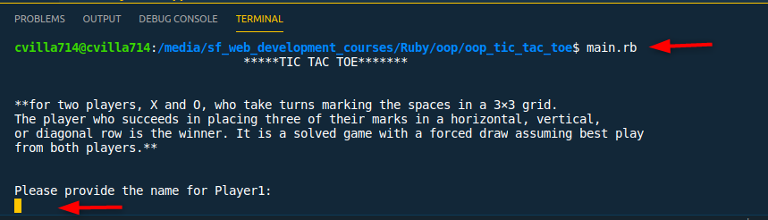
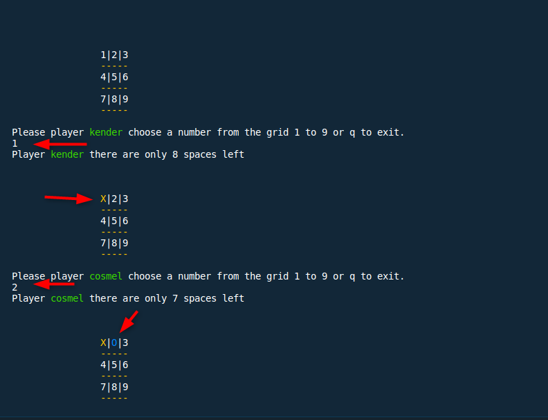
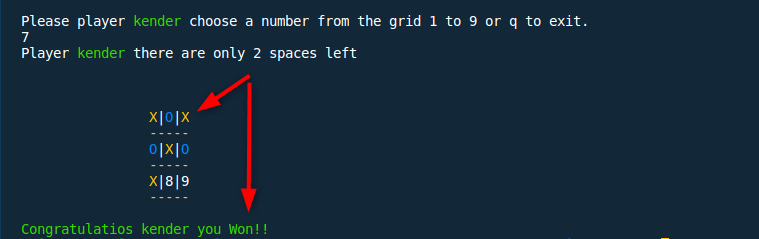
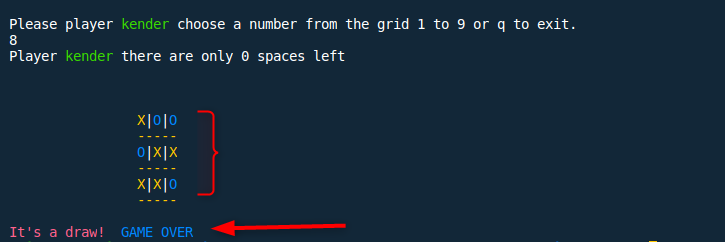

# OOP TIC TAC TOE

> Setup the first milestone for the TIC TAP TOE project

## Built With

- Ruby

## Requirements

- run bundle install

## Instructions
	
> How the game starts 
- The very first thing to do is to type this command man.rb this will start the game.

- First players will be asked to provide the name, it cannot have an empty space and it can be a combination of numbers and letters.

- The first players will be asked to choose between X and O.

- Second Player will be asked for the name, same rules apply no empty characters and it can combination between  lettesr and numbers.

- The Second players won't be asked to choose between X and O because they will be assigned the next value that the first player picked.

- Once the game starts the players will be asked to choose a number from the grid between 1 to 9 or quite the game by pressing the letter q.

- If a players chooses a number from the grid that has already been chosen by the opposite player then you will get a message saying " spot has bee already 
selected please try again".

- In order to win the game, a player must place three of their marks in a horizontal, vertical, or diagonal row.

- The game will end in a draw if no one has three of their marks in a horizontal, vertical or diagonal row.

## Authors

👤 **Devkc**

- Github: [@cvilla714](https://github.com/cvilla714)
- Twitter: [@kckeyti](https://twitter.com/kckeyti)
- Linkedin: [linkedin Profile](https://www.linkedin.com/in/cosmel-villalobos-1900531aa/)

👤 **Kender Bolivar**

- GitHub: [@kenderb](https://github.com/ken)
- Twitter: [@twitterhandle](https://twitter.com/KBTarts)
- LinkedIn: [LinkedIn](https://www.linkedin.com/in/kender-bolivar-1736086b/)

## Show your support

Give a ⭐️ if you like this project!
